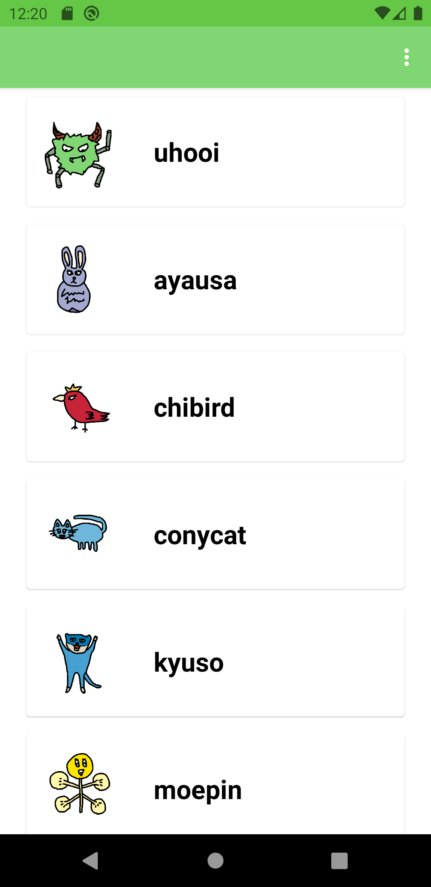
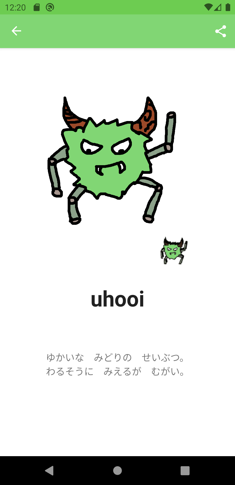
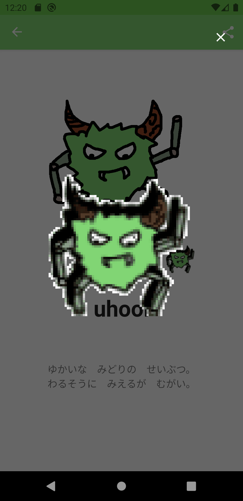
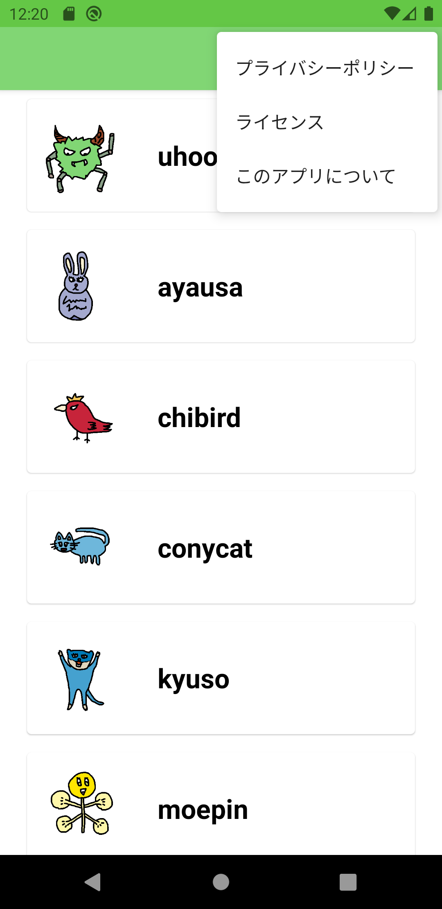
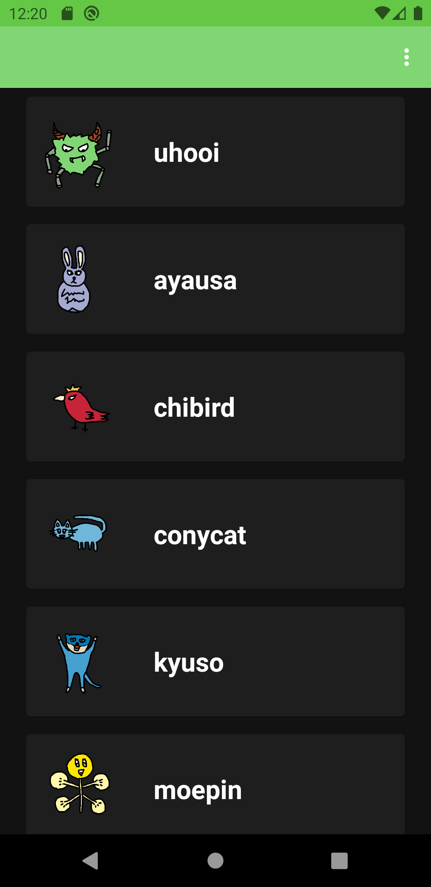
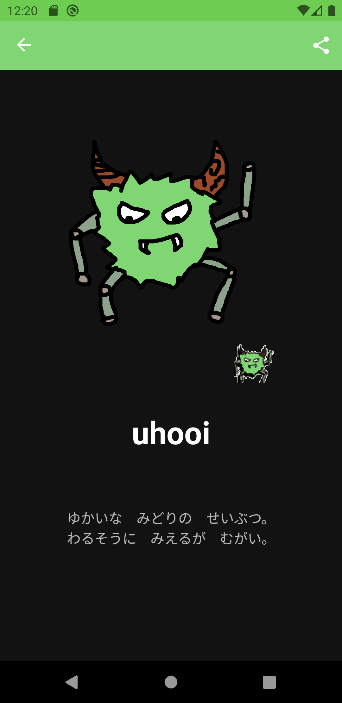
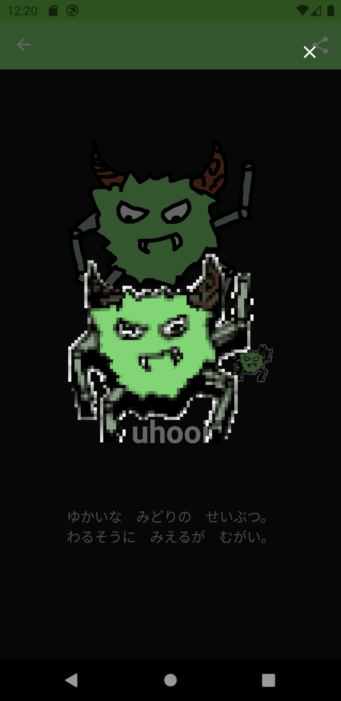
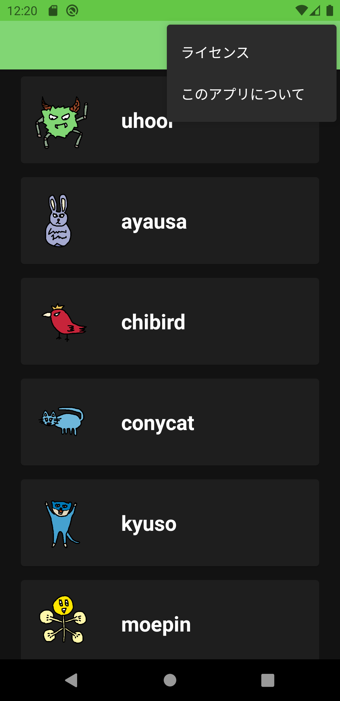

# UhooiPicBook-Android

[](https://github.com/uhooi/UhooiPicBook-Android/releases/latest)
[](https://github.com/uhooi/UhooiPicBook-Android/blob/master/LICENSE)
[](https://github.com/uhooi/UhooiPicBook-Android)
[](https://twitter.com/the_uhooi)

|Branch|CI|Code coverage|
|:--|:--|:--|
|[master](https://github.com/uhooi/UhooiPicBook-Android/tree/master)|[](https://github.com/uhooi/UhooiPicBook-Android/actions/workflows/ci.yml)|[](https://codecov.io/gh/uhooi/UhooiPicBook-Android)|
|[develop](https://github.com/uhooi/UhooiPicBook-Android/tree/develop)|[](https://github.com/uhooi/UhooiPicBook-Android/actions/workflows/ci.yml)|[](https://codecov.io/gh/uhooi/UhooiPicBook-Android)|


UhooiPicBook-Android is Uhooi's character book for Android.

[](https://play.google.com/store/apps/details?id=com.theuhooi.uhooipicbook)

## Screenshots

### Light

|MonsterList|MonsterDetail|DancingMonster|
|:--|:--|:--|
||||

|Menu opened in MonsterList|
|:--|
||

### Dark

|MonsterList|MonsterDetail|DancingMonster|
|:--|:--|:--|
||||

|Menu opened in MonsterList|
|:--|
||

## Development

You can develop this project.

### Environment

- Android Studio: 4.1.3

### Configuration

- Architecture: MVVM
- Branching model: Git-flow

### Setup

1. Clone the project.

```shell
$ git clone https://github.com/uhooi/UhooiPicBook-Android.git
$ cd UhooiPicBook-Android
```

2. Open the project in Android Studio.

## Contribution

I would be happy if you contribute :)

- [New issue](https://github.com/uhooi/UhooiPicBook-Android/issues/new)
- [New pull request](https://github.com/uhooi/UhooiPicBook-Android/compare)
