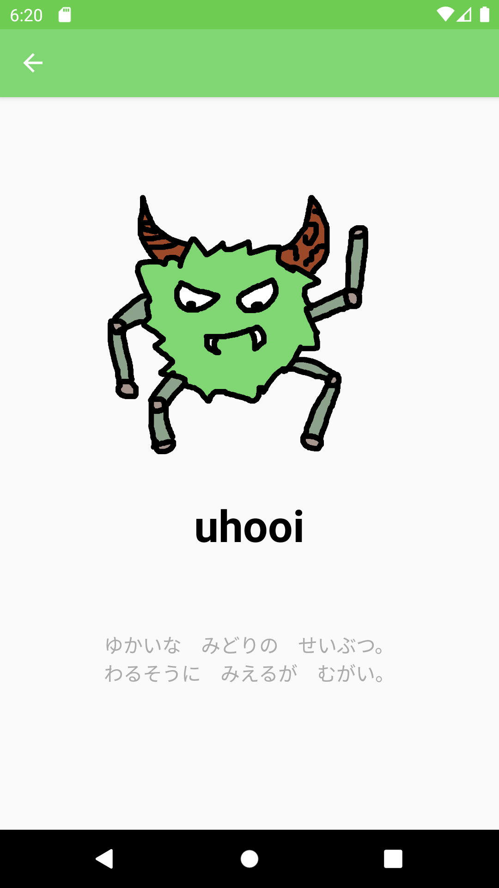

# UhooiPicBook-Android

[](https://github.com/uhooi/UhooiPicBook-Android/actions?query=workflow%3ACI)
[](https://github.com/uhooi/UhooiPicBook-Android/blob/master/LICENSE)
[](https://twitter.com/the_uhooi)


UhooiPicBook-Android is Uhooi's character book for Android.

## Screenshots

|MonsterList|MonsterDetail|
|:--|:--|
|||

## Demo

TBD

## Development

You can develop UhooiPicBook-Android.

### Environment

- Android Studio: 3.6.1

### Configuration

- Architecture: MVVM
- Branching model: Git-flow

### Setup

1. Clone the project.

```
$ git clone https://github.com/uhooi/UhooiPicBook-Android.git
$ cd UhooiPicBook-Android
```

2. Open the project in Android Studio.
