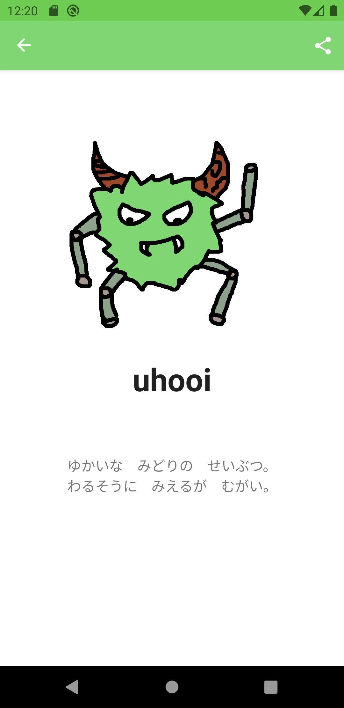
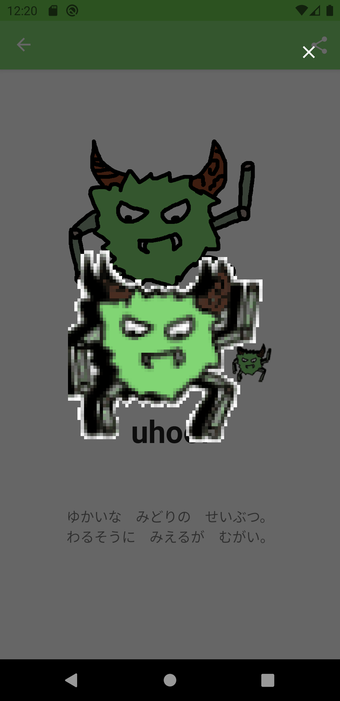
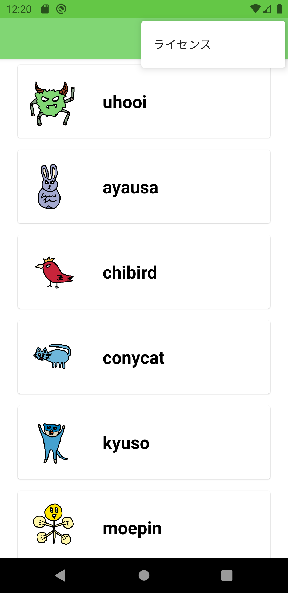
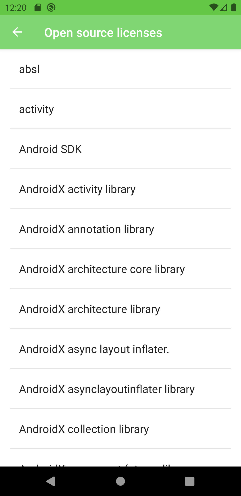
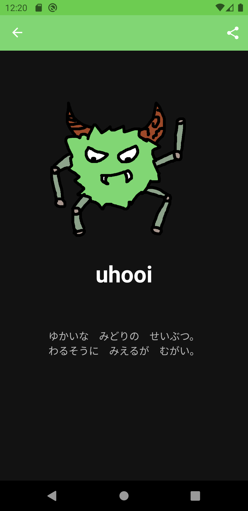
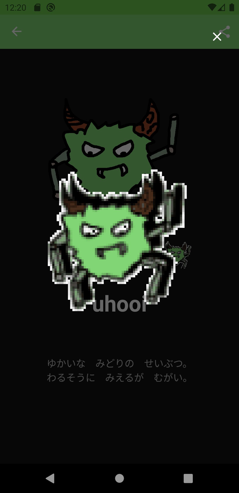
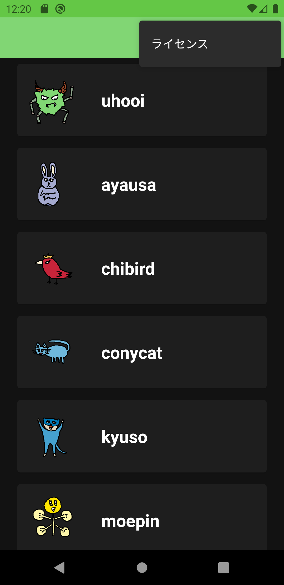

# UhooiPicBook-Android

[](https://github.com/uhooi/UhooiPicBook-Android/actions?query=workflow%3ACI)
[](https://github.com/uhooi/UhooiPicBook-Android/blob/master/LICENSE)
[](https://twitter.com/the_uhooi)


UhooiPicBook-Android is Uhooi's character book for Android.

[](https://play.google.com/store/apps/details?id=com.theuhooi.uhooipicbook)

## Screenshots

### Light

|MonsterList|MonsterDetail|DancingMonster|
|:--|:--|:--|
||||

|Menu opened in MonsterList|Licenses|
|:--|:--|
|||

### Dark

|MonsterList|MonsterDetail|DancingMonster|
|:--|:--|:--|
||||

|Menu opened in MonsterList|Licenses|
|:--|:--|
|||

## Development

You can develop UhooiPicBook-Android.

### Environment

- Android Studio: 4.1.2

### Configuration

- Architecture: MVVM
- Branching model: Git-flow

### Setup

1. Clone the project.

```
$ git clone https://github.com/uhooi/UhooiPicBook-Android.git
$ cd UhooiPicBook-Android
```

2. Open the project in Android Studio.

## Contribution

I would be happy if you contribute :)

- [New issue](https://github.com/uhooi/UhooiPicBook-Android/issues/new)
- [New pull request](https://github.com/uhooi/UhooiPicBook-Android/compare)
